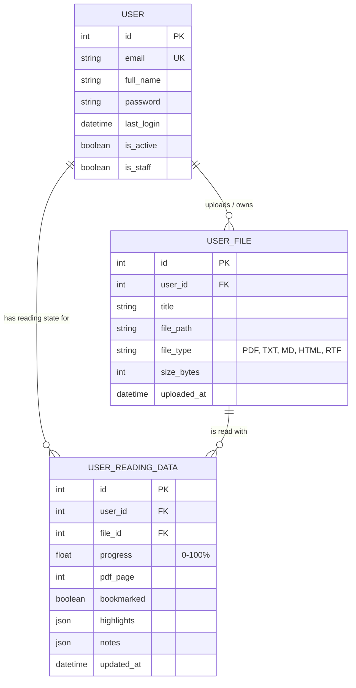

# Database Entity-Relationship Diagram

This diagram outlines the core data models for the application, specifically focusing on Users, their uploaded publications (Books/Files), and their associated reading progress data.

