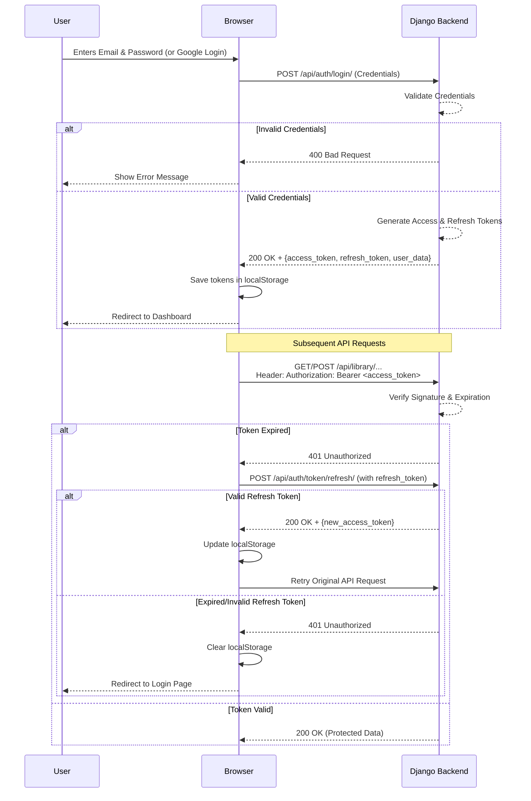

# JWT Authentication Flow

This diagram illustrates how JSON Web Tokens (JWT) are used for secure authentication between the Frontend (Browser) and Backend (Django) APIs.

```mermaid
sequenceDiagram
    participant User
    participant Browser
    participant Django_Backend as Django Backend
    
    %% Login Process
    User->>Browser: Enters Email & Password (or Google Login)
    Browser->>Django_Backend: POST /api/auth/login/ (Credentials)
    Django_Backend-->>Django_Backend: Validate Credentials
    
    alt Invalid Credentials
        Django_Backend-->>Browser: 400 Bad Request
        Browser-->>User: Show Error Message
    else Valid Credentials
        Django_Backend-->>Django_Backend: Generate Access & Refresh Tokens
        Django_Backend-->>Browser: 200 OK + {access_token, refresh_token, user_data}
        Browser->>Browser: Save tokens in localStorage
        Browser-->>User: Redirect to Dashboard
    end
    
    %% API Requests
    Note over Browser, Django_Backend: Subsequent API Requests
    Browser->>Django_Backend: GET/POST /api/library/...<br/>Header: Authorization: Bearer <access_token>
    Django_Backend-->>Django_Backend: Verify Signature & Expiration
    
    alt Token Expired
        Django_Backend-->>Browser: 401 Unauthorized
        Browser->>Django_Backend: POST /api/auth/token/refresh/ (with refresh_token)
        alt Valid Refresh Token
            Django_Backend-->>Browser: 200 OK + {new_access_token}
            Browser->>Browser: Update localStorage
            Browser->>Django_Backend: Retry Original API Request
        else Expired/Invalid Refresh Token
            Django_Backend-->>Browser: 401 Unauthorized
            Browser->>Browser: Clear localStorage
            Browser-->>User: Redirect to Login Page
        end
    else Token Valid
        Django_Backend-->>Browser: 200 OK (Protected Data)
    end
```
