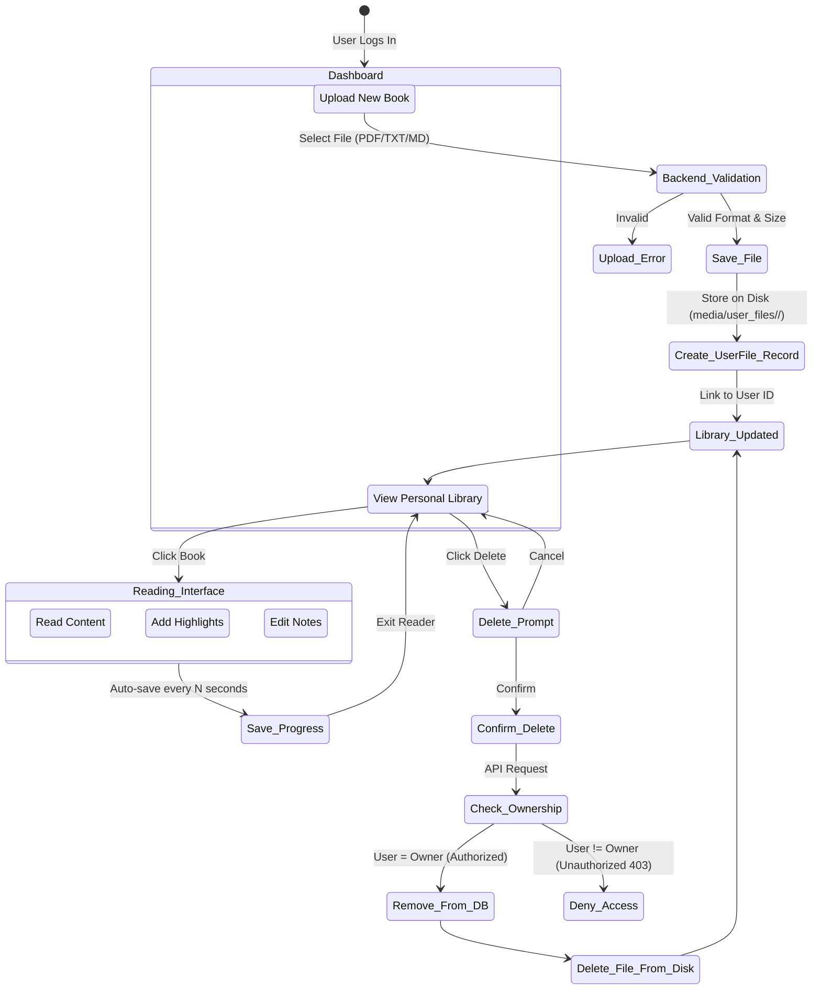

# Publication Workflow Diagram

This diagram maps out how a user can upload their publications (books/files), ensuring they are securely tied to their account and that only the owner can read, edit, or delete them.

